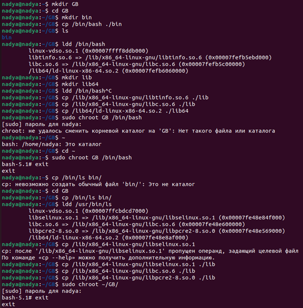
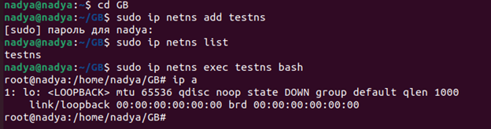
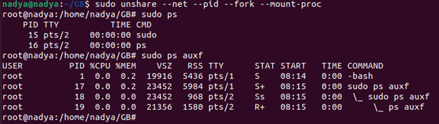

# Уймина Надежда Николаевна
# Программирование | 7 | 3528 / 3527 | 05.10.2022

## Контейнеризация (семинары)

## Урок 1. Механизмы пространства имен
**Задание:** необходимо продемонстрировать изоляцию одного и того же приложения (как решено на семинаре - командного интерпретатора) в различных пространствах имен.

mkdir GB - создаем директорию;
cd GB - переходим в директорию;
mkdir bin - внутри директории создаем папку bin;
cp /bin/bash bin - копируем в нее bash;
ldd /bin/bash -смотрим какие есть зависимости;
mkdir lib lib64 - создаем еще две папки;
cp /lib/x86_64-linux-gnu/libtinfo.so.6 ./lib - копируем зависимости в папки;
cp /lib/x86_64-linux-gnu/libc.so.6 ./lib - копируем зависимости в папки;
cp /lib64/ld-linux-x86-64.so.2 ./lib64 - копируем зависимости в папки;
cd ~ - выходим из директории;
sudo chroot GB - изменения корневого каталога;
cd GB - переходим в директорию;
cp /bin/ls bin/ - копируем ls;
ldd /usr/bin/ls  -смотрим какие есть зависимости;
cp /lib/x86_64-linux-gnu/libselinux.so.1 lib - копируем зависимости;
cp /lib/x86_64-linux-gnu/libc.so.6 lib - копируем зависимости;
cp /lib/x86_64-linux-gnu/libpcre2-8.so.0 lib - копируем зависимости;
sudo chroot ~/GB/ - создаем корень;

ip a сетевое пространство имен. 
sudo ip netns add testns — создали пространство имен;
sudo ip netns list - просмотр пространства имен;
sudo ip netns exec testns bash  - изолируем сеть;

sudo unshare --net --pid --fork  --mount-proc  /bin/bash - изоляция сети, процессов и файловой системы;
unshare утилита которая позволяет разграничивать:
--net — ограничевает сетевое пространство имен ip a;
--pid — изолирует дерево процессов;
--fork — изолирует память;
--mount-proc — разграничивает процессы ps aux;

