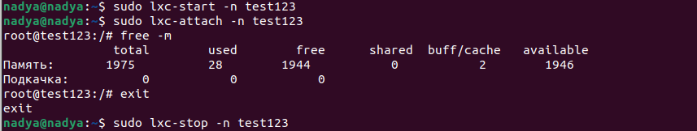
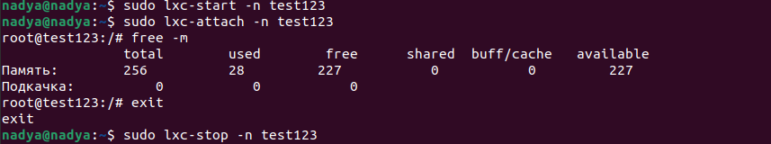

# Уймина Надежда 

# Программирование | 7 | 3528 / 3527 | 05.10.2022

## Контейнеризация (семинары)

## Урок 2. Механизмы контрольных групп

1) запустить контейнер с ubuntu, используя механизм LXC

`sudo lxc-create -n test123 -t ubuntu` - создаем контейнер;

`sudo lxc-start -n test123` - запускаем;

`sudo lxc-attach -n teat123` - войдем в него;

`free -m` - проверяем пямаять;

`exit` - выходим;

`lxc-stop -n test123` - закрываем;

2) ограничить контейнер 256 Мб ОЗУ и проверить, что ограничение работает

`sudo nano /var/lib/lxc/test123/config` - открываем;

прописываем параметры:

    # Container specific configuration

    lxc.cgroup2.memory.max = 256M

`sudo lxc-start -n test123` - запускаем;

`sudo lxc-attach -n teat123` - войдем в него;

`free -m` - проверяем пямаять;

`exit` - выходим;

`lxc-stop -n test123` - закрываем;

**Задание по желанию ..**

3) "добавить автозапуск контейнеру, перезагрузить ОС и убедиться, что контейнер действительно запустился самостоятельно

`sudo nano /var/lib/lxc/test123/config` - открываем;

прописываем параметры:

`# Container specific configuration`
 
`lxc.start.auto  =  1`

4) "при создании указать файл, куда записывать логи

5) "после перезагрузки проанализировать логи

