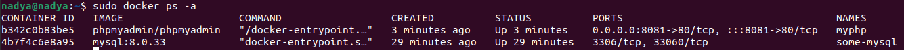
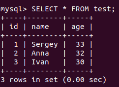

# Уймина Надежда 

# Программирование | 7 | 3528 / 3527 | 05.10.2022

## Контейнеризация (семинары)

## Урок 3. Введение в Docker

1) запустить контейнер с БД, отличной от mariaDB, используя инструкции на сайте: https://hub.docker.com/

`sudo docker pull mysql`- извлечение образа

2) добавить в контейнер hostname такой же, как hostname системы через переменную

`docker run --name some-mysql -e MYSQL_ROOT_PASSWORD=my-secret-pw -d mysql:tag` - запускаем экземпляр MySQL;

3) заполнить БД данными через консоль

`docker exec -it some-mysql bash` - заходим в контейнер;

`mysql -u root -p` - заходим в MySQL;

    CREATE DATEBASE Test;
    
    USE Test;
    
    CREATE TABLE test (id INTEGER PRIMARY KEY AUTO_INCREMENT,name TEXT NOT NULL,age TINYINT NOT NULL);
    
    INSERT INTO test (name, age)VALUES('Sergey',33),('Anna',32),
('Ivan',30);

    SELECT * FROM test;

4) запустить phpmyadmin (в контейнере) и через веб проверить, что все введенные данные доступны

