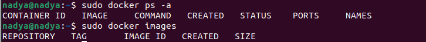
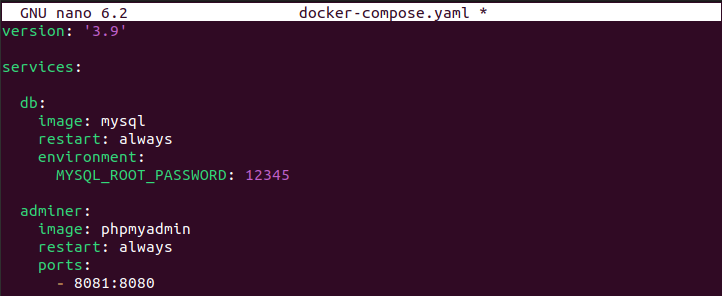
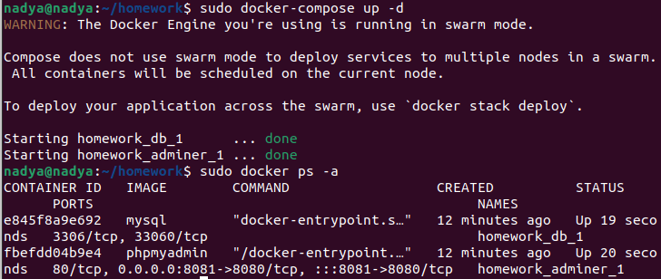

# Уймина Надежда

# Программирование | 7 | 3528 / 3527 | 05.10.2022

## Контейнеризация (семинары)

## Урок 5. Docker Compose и Docker Swarm

**Задание 1:**

1) создать сервис, состоящий из 2 различных контейнеров: 1 - веб, 2 - БД

** не обязательно 2) необходимо создать 3 сервиса в каждом окружении (dev, prod, lab)

** не обязательно 3) по итогу на каждой ноде должно быть по 2 работающих контейнера

Проверяем, что ничего не запущено

С помощью команды `nano docker-compose.yaml` создаем фаил YAML с параметрами

Запускаем проект с помощью команды `docker-compose up`, проверяем запустилась БД и phpmyadmin

